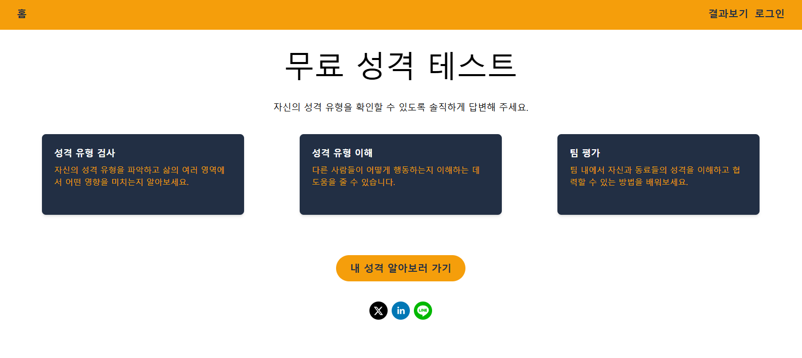
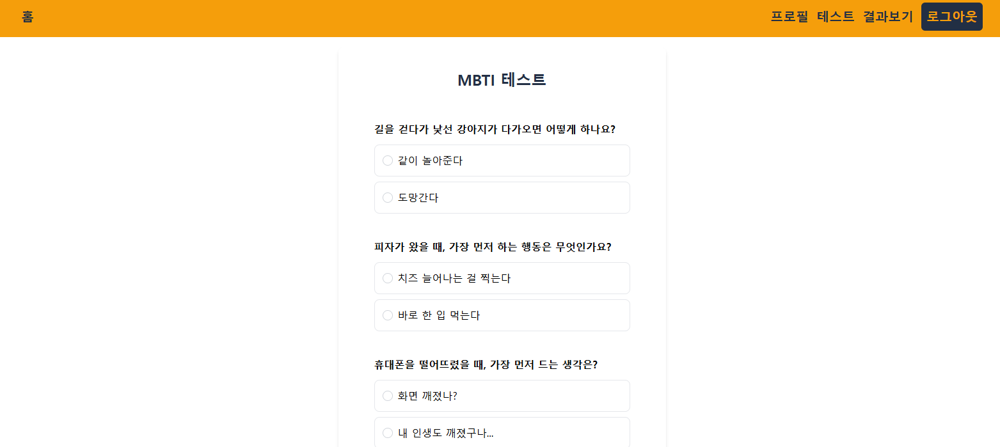
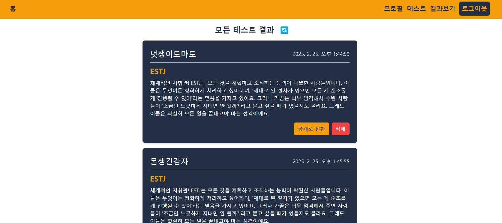

# 🤪 MBTI test: 너의 성격을 알아봐!
- **배포 주소** : https://mbti-test-lime.vercel.app/
 

 
 
 

## 📜프로젝트 소개
>**개발 기간 :** 2025/02/20 ~ 2025/02/25

**MBTI 성격 테스트 사이트**  

간단한 MBTI 테스트를 진행할 수 있는 사이트입니다. 다른 사람들의 결과도 같이 볼 수 있고, 주변에 안 해본 사람이 있다면 SNS로 공유해보세요! 
 
 
 

## 🪄프로젝트 특징
- 외부 서버와 API를 이용해 인가 및 인증을 구현했습니다.
  
- **Zustand**를 사용하여 지역 상태 관리를 했습니다. 
  - `persist`를 활용해 받아온 토큰을 사라지지 않도록 관리했습니다. (그렇습니다. 보안성은 별로입니다!) 
- **Tanstack Query**를 사용하여 서버 상태 관리를 했습니다. 
  - Auth서버, Result서버 이렇게 두 개의 서버에서 오고 가는 상태들을 관리합니다.
- **TailwindCSS**를 사용하여 CSS in JS 스타일링 및 반응형 디자인을 구현했습니다.
- `react-router-dom`을 이용하여 페이지 간 이동을 설정했습니다.
- `react-share`를 사용하여 SNS 공유 기능을 추가했습니다.
- 프로젝트 내부적으로, 이전 프로젝트의 피드백을 적용하려 노력했습니다. 
  - UI 폴더를 따로 구성하여 전체적인 디자인을 통일했습니다. 
  - 페이지와 레이아웃, 컴포넌트를 분리하여 재사용성과 유지보수성을 높였습니다. 
 
 
 

## 🔫트러블 슈팅
- ### [안 보여야 할 것이 보인다](https://velog.io/@arendt9797/%ED%8A%B8%EB%9F%AC%EB%B8%94%EC%8A%88%ED%8C%85-%EC%95%88-%EB%B3%B4%EC%97%AC%EC%95%BC-%ED%95%A0-%EA%B2%83%EC%9D%B4-%EB%B3%B4%EC%9D%B8%EB%8B%A4)

 
 
 

## 🖥️기술 스택
### 환경
  

### 개발
 